# chem-0

<p align="center">
  <strong>Attention:</strong> active follow-on work has moved to
  <a href="https://github.com/JacobFV/phys-0">JacobFV/phys-0</a>.
</p>


## A small research project in embodied laboratory automation

`chem-0` explores a practical question:

> Can a language-model agent safely operate a low-cost robot arm while using a
> live camera feed as its visual feedback loop?

This repository contains a compact local experiment platform for a Hugging Face
LeRobot SO-101/SO-100 follower arm. Both the stdio MCP server and the Electron
GUI use the same TypeScript Node backend. That backend owns experiment tracking,
SQLite persistence, blob artifacts, OpenAI GPT-5.5 streaming sessions, optional
human voice I/O, and the small Python bridge used for LeRobot/OpenCV hardware
calls.

The project is intentionally small enough to understand at a science-fair table:

1. The robot arm is calibrated into a known coordinate space.
2. The camera returns a frame to the agent.
3. The agent receives a table of safe reference poses.
4. The agent chooses a target joint pose or Cartesian position.
5. The Node backend validates and logs the command, then moves the arm in small steps.

## Why This Matters

Many lab automation demos assume expensive industrial hardware, custom GUIs, or
hard-coded scripts. `chem-0` asks whether a simple open-source interface can
make robot control more inspectable:

- Every command is a named tool call, whether it came from MCP or Electron.
- Every full-arm movement is a six-number pose or a bounded Cartesian target.
- Every pose is checked against calibrated limits.
- Cartesian motion uses a repo-local SO-101 URDF plus LeRobot/`placo` FK.
- Every agent can read the same pose table before moving.
- Camera frames are available through the same MCP channel as motion commands.
- The desktop console displays live camera views beside live 3D SO-101 mesh
  views for detected connected arms.
- Experiments are persisted to local SQLite, with camera frames stored as local
  blob artifacts beside the database.
- The agent can talk to nearby humans through OpenAI TTS/STT, with optional
  ElevenLabs TTS.

That makes the system useful for studying agentic control, safety boundaries,
visual feedback, and the gap between language-model spatial reasoning and real
hardware.

## What Is In The Repo

```text
src/lib/backend/          TypeScript Node backend: experiments, SQLite, blobs, GPT-5.5, Python bridge
src/lib/chem0/            Python hardware core: robot, camera, kinematics, tool handlers
src/apps/mcp-node/        TypeScript stdio MCP server entrypoint
src/apps/python-bridge/   Line-delimited JSON bridge from Node to Python core
src/apps/electron/        Chem-0 Lab Console desktop app
scripts/                  Setup, dependency, and deterministic calibration scripts
assets/                   Welcome image and SO-101 kinematic URDF
docs/                     Detailed setup, operations, testing, and references
AGENTS.md                 Agent handoff and operating instructions
GEMINI.md                 Same as AGENTS.md
CLAUDE.md                 Same as AGENTS.md
```

## System Diagram

```mermaid
flowchart LR
    agent["MCP Client / LLM Agent<br/>Codex, Claude, Gemini, etc."]
    desktop["Chem-0 Lab Console<br/><code>src/apps/electron</code>"]
    mcp["Node stdio MCP Server<br/><code>src/apps/mcp-node</code>"]
    backend["Shared Node Backend<br/><code>@chem0/backend</code>"]
    db["SQLite Experiment Store<br/><code>data/chem0.sqlite</code>"]
    blobs["Blob Store<br/><code>data/blobs</code>"]
    openai["OpenAI Responses API<br/><code>gpt-5.5</code>"]
    audio["Voice I/O<br/><code>speak_to_human</code><br/><code>listen_to_human</code>"]
    bridge["Python Bridge<br/><code>src/apps/python-bridge</code>"]
    core["Python Core<br/><code>src/lib/chem0</code>"]
    pose["Pose Table Resource<br/><code>lerobot://pose-table</code>"]
    ik["SO-101 FK / IK<br/><code>placo</code> + URDF"]
    safety["Validation + Step Interpolation<br/>joint limits, workspace, max_step"]
    expert["Expert Placeholder<br/><code>ask_export(question)</code>"]
    camera["OpenCV Camera<br/>camera_id 0"]
    robot["LeRobot SO-101/SO-100<br/>follower arm"]
    bus["Feetech STS3215 Servo Bus<br/>IDs 1-6 at 1 Mbps"]
    calib["Saved Calibration<br/><code>mcp_so101.json</code>"]

    agent <-->|"stdio MCP<br/>tools + resources"| mcp
    desktop <-->|"IPC<br/>streaming events + tool calls"| backend
    mcp <-->|"backend API"| backend
    backend -->|"experiments<br/>sessions<br/>events"| db
    backend -->|"camera/tool artifacts"| blobs
    backend <-->|"agent stream<br/>tool loop"| openai
    backend -->|"TTS/STT"| audio
    backend <-->|"JSON lines"| bridge
    bridge -->|"dispatch"| core
    core -->|"resources/read"| pose
    core -->|"list_cameras<br/>view_camera"| camera
    camera -->|"JPEG / PNG frame"| core
    core -->|"connect_so101<br/>observe|get_arm_pose"| robot
    core -->|"get_position<br/>set_position"| ik
    ik -->|"IK joint target"| safety
    core -->|"set_arm_pose"| safety
    core -->|"ask_export"| expert
    safety -->|"validated joint action"| robot
    calib -->|"joint limits + homing"| core
    robot <-->|"serial commands"| bus

    classDef agent fill:#eef6ff,stroke:#8fbceb,color:#17324d
    classDef server fill:#f0f8f3,stroke:#92c8a0,color:#1f4d2d
    classDef core fill:#f2fbef,stroke:#8fbd76,color:#264d1a
    classDef safety fill:#fff7ec,stroke:#e0ad6e,color:#5d3d16
    classDef ik fill:#eefaf9,stroke:#79bbb4,color:#164d49
    classDef expert fill:#f7f7f7,stroke:#aaa,color:#333
    classDef hardware fill:#f4f1ff,stroke:#a99be8,color:#2f255f
    class agent,desktop agent
    class mcp,backend,bridge,db,blobs,openai,audio,pose,calib server
    class core core
    class safety safety
    class ik ik
    class expert expert
    class camera,robot,bus hardware
```



## MCP Affordance Map

```mermaid
flowchart TB
    client["MCP Client / Agent"]
    server["Shared Node Backend + MCP Surface"]

    discovery["Discovery<br/><code>list_serial_ports</code><br/><code>list_cameras</code>"]
    vision["Vision<br/><code>view_camera</code><br/>JPEG / PNG MCP image"]
    bus_tools["Servo Bus + Connection<br/><code>probe_feetech</code><br/><code>connect_so101</code><br/><code>disconnect</code>"]
    state["State + Context<br/><code>observe</code><br/><code>get_arm_pose</code><br/><code>get_pose_table</code><br/><code>lerobot://pose-table</code>"]
    joint_motion["Joint-Space Motion<br/><code>set_arm_pose</code><br/><code>move_relative</code>"]
    cart_motion["Cartesian Motion<br/><code>get_position</code><br/><code>set_position</code><br/>position-only IK"]
    gripper["Gripper<br/><code>open_gripper</code><br/><code>close_gripper</code>"]
    expert_tool["Expert Placeholder<br/><code>ask_export(question)</code><br/>returns expert not available"]
    voice["Human Voice<br/><code>speak_to_human</code><br/><code>listen_to_human</code>"]
    experiments["Experiments<br/><code>create_experiment</code><br/><code>list_experiments</code><br/><code>list_agent_session_events</code><br/><code>list_experiment_artifacts</code>"]

    client -->|"stdio MCP"| server
    server --> discovery
    server --> vision
    server --> bus_tools
    server --> state
    server --> joint_motion
    server --> cart_motion
    server --> gripper
    server --> expert_tool
    server --> voice
    server --> experiments

    classDef client fill:#eef6ff,stroke:#8fbceb,color:#17324d
    classDef server fill:#f0f8f3,stroke:#92c8a0,color:#1f4d2d
    classDef affordance fill:#fffdf7,stroke:#d2bd7d,color:#3d3416
    class client client
    class server server
    class discovery,vision,bus_tools,state,joint_motion,cart_motion,gripper,expert_tool,voice,experiments affordance
```



## Core MCP Tools

The server exposes tools for discovery, vision, robot state, and movement:

- `list_serial_ports`
- `list_cameras`
- `view_camera`
- `probe_feetech`
- `connect_so101`
- `observe`
- `get_arm_pose`
- `get_pose_table`
- `get_position`
- `set_arm_pose`
- `set_position`
- `open_gripper`
- `close_gripper`
- `ask_export`
- `speak_to_human`
- `listen_to_human`
- `record_ph`
- `move_relative`
- `disconnect`
- `create_experiment`
- `list_experiments`
- `list_agent_session_events`
- `list_experiment_artifacts`
- `set_default_robot`
- `get_default_robot`

It also exposes the MCP resource:

```text
lerobot://pose-table
```

That resource gives agents calibrated limits, units, orientation notes, and
common reference poses.

## Six-Parameter Pose Interface

The joint-space motion interface is `set_arm_pose`. It requires exactly six
values and returns the same ordered tuple.

```json
{
  "pose": {
    "shoulder_pan": -109,
    "shoulder_lift": 0,
    "elbow_flex": -70,
    "wrist_flex": 0,
    "wrist_roll": -164,
    "gripper": 0.5
  },
  "max_step": 5
}
```

Units:

- `shoulder_pan`: degrees
- `shoulder_lift`: degrees
- `elbow_flex`: degrees
- `wrist_flex`: degrees
- `wrist_roll`: degrees
- `gripper`: percent, `0..100`

By default, poses outside calibrated limits are rejected.

## Cartesian IK Interface

The Cartesian layer is intentionally small:

- `get_position` returns `[x, y, z, gripper]`.
- `set_position` accepts `x`, `y`, `z`, and optional `gripper`.
- Units are meters in the SO-101 URDF base frame for `x/y/z`.
- The gripper remains percent `0..100`.

The default workspace is conservative:

```text
x: -0.35..0.35 m
y: -0.35..0.35 m
z:  0.02..0.60 m
```

The server uses `assets/kinematics/so101_kinematics.urdf` and LeRobot's
`RobotKinematics`/`placo` FK path. A compact damped-least-squares IK loop
computes a six-joint target, then routes the movement through the same joint
limit checks and step interpolation as `set_arm_pose`.

## Known Local Hardware Defaults

The current physical setup was tested with:

```text
robot id: mcp_so101
serial port: /dev/cu.usbmodem5AB01815731
camera id: 0
calibration: ~/.cache/huggingface/lerobot/calibration/robots/so_follower/mcp_so101.json
```

Each physical arm should have its own LeRobot calibration id. For a new arm,
run deterministic endpoint calibration instead of reusing the old `mcp_so101`
file:

```sh
npm run calibrate:so101 -- \
  --port /dev/tty.usbmodem5A460833421 \
  --robot-id mcp_so101_b
```

The script prompts for `Z1`, `X1`, `X2`, `X3`, `Z2`, and `Hand` endpoints,
then writes a LeRobot-compatible calibration file and servo register limits for
that `robot_id`.

The Electron app exposes the same deterministic workflow through a **Calibrate**
button in the top-right toolbar. It opens a dedicated window with detected
robot buses, the actual upstream SO-101 visual URDF/STL mesh model, a live
raw-position overlay, an endpoint orientation guide, and step-by-step endpoint
recording.

The last validated visual pose was approximately:

```text
shoulder_pan.pos:  about -109
shoulder_lift.pos: about 0
elbow_flex.pos:    about -70
wrist_flex.pos:    about 0
wrist_roll.pos:    about -164
gripper.pos:       about 0.5
```

## Quick Start

Install dependencies:

```sh
python -m venv .venv
.venv/bin/python -m pip install --upgrade pip
./scripts/install_deps.sh
```

Run the server:

```sh
npm install
npm run build
node src/apps/mcp-node/dist/server.js
```

Run Chem-0 Lab Console:

```sh
npm install
npm run electron:dev
```

Mount it in Codex:

```json
{
  "mcpServers": {
    "chem-0": {
      "command": "node",
      "args": [
        "/Users/vibestartup/Code/lerobot-test/src/apps/mcp-node/dist/server.js"
      ],
      "env": {}
    }
  }
}
```

Then ask the agent:

```text
Use the chem-0 MCP. Create an experiment first, pass its experiment_id into
tool calls, read lerobot://pose-table, list cameras, view camera 0, probe the
LeRobot servos, connect to the SO101 arm, observe the current pose, then use
get_arm_pose/set_arm_pose for joint-space moves or get_position/set_position
for IK moves. Keep max_step <= 5 and stay inside calibrated limits.
```


Calibration:
You can either use the electron app to calibrate the arm with the UI, or run `uv run python scripts/watch_servo_calibration.py /dev/tty.usbmodem5A7A0187661` (replace with leader/follower port) to see joint results being polled per 2 seconds.

Optional voice environment:

```sh
export OPENAI_API_KEY=...
export ELEVENLABS_API_KEY=... # optional
export ELEVENLABS_VOICE_ID=... # optional
```

`speak_to_human` uses OpenAI TTS by default. It can use ElevenLabs with
`provider: "elevenlabs"`, and falls back to OpenAI when ElevenLabs is not
configured. `provider: "system"` uses macOS system speech. `listen_to_human`
transcribes Electron-recorded mic clips or an MCP-provided local `audio_path`.
The shared backend also loads a repo-root `.env` file automatically.

For multi-arm setups, robot motion/state tools accept optional `robot_id`. Use
`set_default_robot(robot_id)` once to set the backend default for later calls
that omit `robot_id`; use `get_default_robot()` to inspect it.

## Documentation

- [docs/setup.md](docs/setup.md): hardware and software setup
- [docs/architecture.md](docs/architecture.md): reusable Mermaid architecture diagram
- [docs/backend.md](docs/backend.md): shared backend data model and tracking behavior
- [docs/desktop.md](docs/desktop.md): Electron app structure and local run commands
- [docs/mcp-tools.md](docs/mcp-tools.md): full tool contracts and examples
- [docs/pose-table.md](docs/pose-table.md): pose semantics and reference poses
- [docs/kinematics.md](docs/kinematics.md): FK/IK setup and Cartesian conventions
- [docs/operations.md](docs/operations.md): safe operating workflow
- [docs/testing.md](docs/testing.md): validation commands and expected results
- [docs/troubleshooting.md](docs/troubleshooting.md): common hardware and camera issues
- [docs/research-notes.md](docs/research-notes.md): project framing and next experiments

## Current Status

Working and tested:

- camera discovery and JPEG frame capture
- Feetech servo probe for IDs `1..6`
- calibrated robot connection
- six-joint observation
- absolute no-op `set_arm_pose` test
- repo-local SO-101 URDF loading through `placo`
- FK smoke test for `get_position`
- incremental real movement through `set_arm_pose`
- TypeScript Node backend shared by MCP and Electron
- local SQLite experiment/session/event persistence
- local blob artifact persistence for camera/tool images
- Electron app with experiment selection and GPT-5.5 streaming session UI
- optional `speak_to_human` and `listen_to_human` voice tools
- `record_ph` pH samples for live experiment charts
- Electron microphone recording routed through the shared backend STT tool
- TypeScript MCP server that logs tool calls/responses when `experiment_id` is provided

Known limitation:

- The Feetech bus can intermittently drop a status packet immediately after
  motion. The server retries observations, but operators should still keep
  motions small and visually monitored.
- OpenAI TTS/STT and GPT-5.5 sessions require `OPENAI_API_KEY`; ElevenLabs TTS
  requires `ELEVENLABS_API_KEY` only when explicitly selected.

## Repository

```text
https://github.com/JacobFV/chem-0
```
